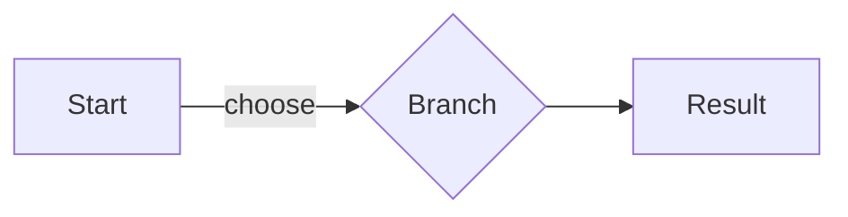

# Diagram authoring

Use a Mermaid code block for a simple flowchart. zpres renders the supported
syntax as SVG in both HTML and static output. For diagrams outside this
subset, export an SVG from another tool and include it as a
[Figure](figure-authoring.md).

## Mermaid flowcharts

Use a `mermaid` fenced code block for simple flowcharts:

````markdown

````

The supported subset includes `graph` and `flowchart` diagrams with `TD`,
`TB`, `BT`, `LR`, or `RL` direction and `-->` edges. Nodes can use plain IDs or
simple labels such as `A[Start]`, `B(Branch)`, and `C{Decision}`. Edge labels
use the Mermaid form `A -->|label| B`.

Advanced Mermaid diagram families such as sequence diagrams, Gantt charts, and
class diagrams fail with a diagnostic. Rendering the supported subset before
capture keeps PDF, PNG, and JPEG output deterministic.

## Theme hooks

Themes receive Mermaid flowcharts as `.zpres-block-diagram` with
`data-diagram-language="mermaid"`, an inline `.zpres-diagram-svg`, and nested
hooks for `.zpres-diagram-node`, `.zpres-diagram-edge`,
`.zpres-diagram-edge-label`, `.zpres-diagram-arrow`, and
`.zpres-diagram-surface`.
