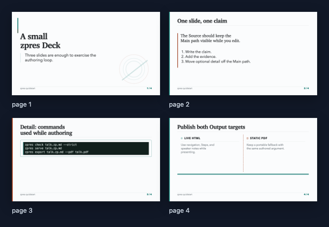
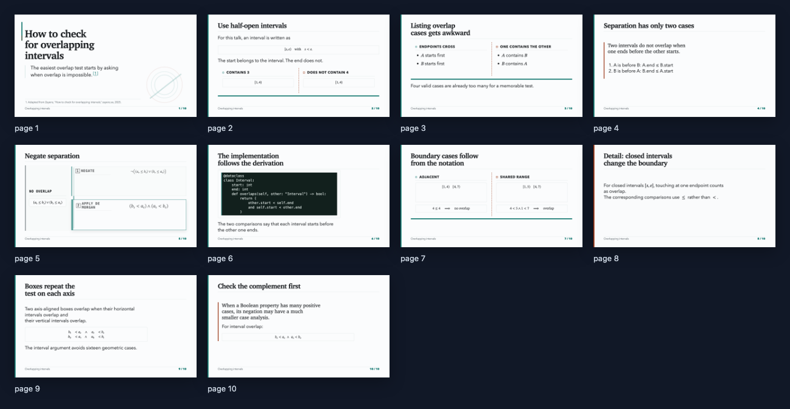

# Example Decks

The examples are complete Source files that can be checked, served, and
exported from the repository root.

| Deck | HTML bundle | PDF | Preview |
| --- | --- | --- | --- |
| Quickstart | [Open locally](quickstart/rendered/index.html) | [Slides](quickstart/rendered/talk.pdf) | [Contact sheet](quickstart/rendered/preview.png) |
| Overlapping intervals | [Open locally](overlapping-intervals/rendered/index.html) | [Slides](overlapping-intervals/rendered/talk.pdf) | [Contact sheet](overlapping-intervals/rendered/preview.png) |

GitHub displays HTML source; clone or download the repository and open the
HTML file in a browser. Keep its `assets` directory alongside it.





- [`quickstart/talk.zp.md`](quickstart/talk.zp.md) has three Main slides
  and one Detail slide, including Steps and speaker notes.
- [`overlapping-intervals/talk.zp.md`](overlapping-intervals/talk.zp.md) is a
  short technical talk adapted from
  [How to check for overlapping intervals](https://zayenz.se/blog/post/how-to-check-for-overlapping-intervals/).

```sh
cargo run -- check examples/quickstart/talk.zp.md --strict
cargo run -- serve examples/overlapping-intervals/talk.zp.md
cargo run -- export examples/overlapping-intervals/talk.zp.md \
  --pdf dist/overlapping-intervals.pdf
```

Regenerate the checked-in output with `python3 examples/render.py` from a
checkout. This requires Rust, Python 3, and Chrome or Chromium. Rendered files
are kept in Git but excluded from the Rust package.
