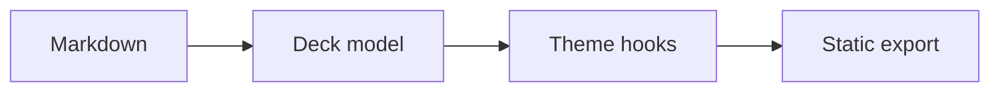
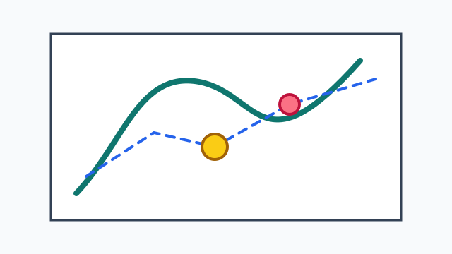
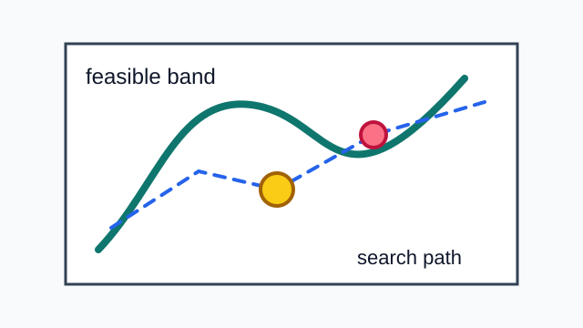

image-corner-radius: 18

# Canonical wide-sweep zpres fixture

::: variant section-title
:::

This deck is deliberately broad. It exists to pressure standard zpres
capabilities, semantic theme hooks, screen rendering, print rendering, static
readiness, and live authoring behavior.

::: notes
Start by checking whether the generated background splash, title treatment, and
speaker notes styling feel coherent.
:::

---

# Claim: intent should survive styling

::: class lead result
:::

Good presentation themes should make common authoring shapes feel natural[^intent].

* structure
* hierarchy
* export safety

::: steps
1. State the claim.
2. Reveal the supporting structure.
3. Land on the export constraint.
:::

[^intent]: Footnotes remain part of the slide-local semantic surface.

<!--
Setup before the first reveal.
[click] Tie the list to the theme hooks.
[click:3] Point out that static export keeps the final state.
-->

--

## Detail: authoring contract

[fit] Preserve author intent.

> The Source file remains text-first while the output feels designed.

> [!NOTE] Theme contract
> Classes, fit text, quotes, callouts, footnotes, transitions, and speaker notes share one contract.

---

# Derivation: model and implementation

::::: derivation
:::: context label="Invariant"
For a transition model \(f\):

$$
x_{t+1} = f(x_t, u_t)
$$
::::
:::: stage label="Implementation"
```rust
fn score(signal: f64) -> f64 {
    signal.max(0.0).sqrt()
}
```
::::
:::: stage label="Pipeline"

::::
:::::

--

## Detail: Dense comparison table

::: variant dense
:::

| Element | Theme question | Hook |
| --- | --- | --- |
| Table | Is dense data readable? | `.zpres-block-table` |
| Code | Is monospace contrast clear? | `.zpres-block-code` |
| Math | Does display math breathe? | `.zpres-block-math` |
| Notes | Are private notes hidden? | `.zpres-speaker-notes-source` |

The dense variant should preserve a clear reading path instead of simply
shrinking everything equally.

```text reveal="1|2"
measure dense roles
report readable bounds
```

---

# Runtime chart

::: vega-lite
{
  "$schema": "https://vega.github.io/schema/vega-lite/v5.json",
  "data": { "url": "data/wide-runtime.csv" },
  "mark": "line",
  "encoding": {
    "x": { "field": "size", "type": "quantitative" },
    "y": { "field": "runtime_ms", "type": "quantitative" },
    "color": { "field": "model", "type": "nominal" }
  }
}
:::

---

# Figure sizing and treatment

::: variant figure
:::

::: background src="assets/phase-space.svg" intent="contextual" alt="Phase-space background" position="center 42%" dim="84" grayscale="24" saturate="82"
:::

::: figure src="assets/phase-space.svg" alt="Phase-space sketch" caption="A local SVG checks figure sizing, fitting, alignment, treatment, and radius." width="72%" height="44vh" fit="contain" align="center" dim="8" grayscale="12" saturate="96" blur="1" radius="18"
:::

---

# Gallery and local media

::: variant figure
:::




---

# Iframe fallback card

::: iframe src="https://example.com/demo" title="Remote interactive demo" alt="Interactive solver demo poster" poster="assets/media-poster.svg" width="62%" fit="contain" align="center"
The live deck can host a remote iframe while static export uses this local
poster card.
:::

---

# Split background and columns

::: variant comparison
:::



::: columns widths="40/60" gap="4" align="start"
Left column:

- structure
- contrast
- rhythm

Right column:

A theme should keep related ideas visually related without asking authors to
write custom CSS inside their talk.
:::

---

# Pandoc-style imported columns

:::: {.columns}
::: {.column width="35%" name="Evidence"}
{out-width="85%" fig-align="center" fig-alt="Small phase-space figure" fig-cap="Pandoc-style figure attributes"}
:::

::: {.column width="65%" name="Explanation"}
- imported column syntax lowers to the same layout model
- figures inside regions keep dependency checks
- themes see the same semantic hooks
:::
::::

---

<!--
_backgroundColor: "#101820"
_color: "#f8fafc"
_class: result
_footer: "Spot directive footer"
_paginate: true
-->

# Marpit-style spot directives

This slide checks comment directive import for local colors, classes, footers,
and pagination without requiring raw HTML in the visible slide body.

---

# Slide metadata block

::: slide
variant: claim
classes: [hero]
autoscale: true
transition: zoom
colors:
  background: "#f7fbf8"
  text: "#17211f"
  accent: "#256f6c"
background:
  src: assets/phase-space.svg
  intent: contextual
  alt: "Phase-space field behind the claim"
  split: left:32%
  dim: 88
:::

Slide metadata should feed the same theme hooks as shorter directives.

---

# Main path with detail slides

This section checks that the main slide and detail slides stay attached in the
model and linearize correctly for PDF export.

^ Deckset-style caret notes should be private presenter notes.
^ Mention that the next two slides are detail slides.

--

## Detail: export-only HTML

This detail slide checks that backup slides and HTML-only blocks remain visible
to the theme contract.

::: html
<aside class="fixture-callout">HTML-only wide-sweep fixture block</aside>
:::

--

## Detail: one page per step

This detail slide checks one-page-per-step export policy.

::: steps pdf="pages"
1. First export page.
2. Second export page.
:::

::: {.notes}
This Quarto-style notes block should appear only in presenter notes and note
exports.
:::
