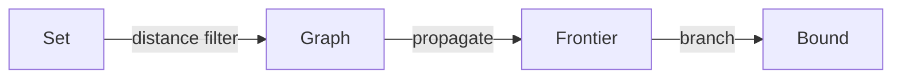

# Midnight constraint atlas

::: variant section-title
:::

[fit] Map the search space, isolate the bound, and keep every technical mark legible.

::: notes
The coordinate field, luminous index marks, and dark evidence panels should survive on screen and print.
:::

---

# Independent-set bounds constrain packing

Every codeword excludes a Hamming ball of radius $d-1$.

- The ambient cube supplies the coordinate system.
- Propagation removes incompatible candidate words.
- Search certifies the surviving lower bound.

---

# One bound changes the whole atlas

::: variant claim
:::

[fit] A stronger distance bound turns local conflicts into global exclusions.

---

# Two encodings expose different work

::::: comparison
:::: primary label="Pairwise conflicts"
Explicit atlas

- one edge per forbidden pair
- immediate local explanation
::::
:::: supporting label="Hamming spheres"
Geometric atlas

- one exclusion region per word
- stronger global structure
::::
:::::

---

# Tighten the bound in stages

::: variant derivation
:::

```text reveal="1-2|3-4|5-6"
C ← candidate codewords
G ← conflict graph at distance d
propagate forced exclusions in G
branch on the largest conflict degree
record the best surviving packing
certify |C| against the target bound
```

---

# The feasible region stays large

::: variant figure
:::

::: figure src="assets/dark-splash-orbit.png" alt="Nested feasible regions connected by a search path" caption="The dark atlas frame keeps paper evidence distinct from the surrounding coordinate field." fit="contain" radius="2"
:::

---

# Search follows the shrinking frontier



---

# Runtime follows conflict density

::: vega-lite
{
  "$schema": "https://vega.github.io/schema/vega-lite/v5.json",
  "data": { "url": "data/columns-runtime.csv" },
  "mark": { "type": "line", "point": true },
  "encoding": {
    "x": { "field": "n", "type": "quantitative", "title": "Candidate words" },
    "y": { "field": "ms", "type": "quantitative", "title": "Runtime (ms)" }
  }
}
:::

--

## Detail: the certificate ledger

::: variant dense
:::

| Bound | Candidates | Conflicts | Runtime |
| --- | ---: | ---: | ---: |
| $d \ge 4$ | 256 | 1,408 | 2.8 s |
| **$d \ge 6$** | **112** | **684** | **8.7 s** |
| $d \ge 8$ | 38 | 171 | 31.2 s |

$$
A(n,d) = \max\{|C| : C \subseteq \{0,1\}^n,\ d_{\min}(C) \ge d\}
$$

---

# Context remains atmospheric

::: background src="assets/science-orbit.svg" intent="decorative" dim="88" grayscale="100" saturate="45"
:::

The full-field image is decorative. A dark atlas scrim protects the reading lane.

---

# Split evidence keeps its own lane


The left lane states the result while the right lane remains available for evidence.

- focal content is not cover-cropped
- evidence is described independently
- the dark surface remains continuous

---

# Context has a separate coordinate lane


::: theme density=spacious footer=slide-number
:::

The image explains the setting without being asked to prove the result.

---

::: slide
theme:
  density: compact
  footer: section-title
  background: "#071015"
  surface: "#102027"
  text: "#f4fbfc"
  muted: "#aac0c7"
  accent: "#45e3ff"
  accent_alt: "#f4ff66"
  rule: "#34535c"
  font_heading: '"Avenir Next Condensed", "Arial Narrow", ui-sans-serif, sans-serif'
  font_body: '"Avenir Next", Aptos, ui-sans-serif, sans-serif'
  font_mono: 'Menlo, Consolas, ui-monospace, monospace'
:::

# Parameters change the plate

This compact cyan plate exercises every role color, each font stack, density, and the Section-title footer mode without changing the Theme grammar.
