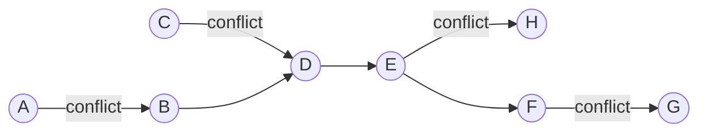

# Conflict thresholds over selected vertices

::: variant section-title
:::

$$
z = \min_{1 \le i < j \le p} W[x_i,x_j]
$$

One graph · three inference kernels · one matching certificate

::: notes
The specimen uses a synthetic conflict-graph model to pressure-test register
geometry without depending on a production talk.
:::

---

# Propagation wins before search begins

::: slide
variant: claim
classes: [billboard, result]
:::

A fixed pair can lower the objective bound immediately.

---

# Longer claims keep their supporting evidence

::: variant claim
:::

[fit] Dedicated propagation combines local pair reasoning with a separate matching upper bound over the active-site union.

- Pair checks tighten the bound after assignment.
- Forward-bound removes values inside the active radius.
- A greedy matching refutes impossible distance levels.

---

# Seven conflicts rule out five vertices at threshold five

::: variant figure
:::



Four disjoint conflict edges leave room for at most four sites.

$$
\alpha(G_5) \le 8-4=4 < p
$$

---

# Pair support and matching answer different questions

::: class result
:::

::::: comparison
:::: primary label="Pair support"
Shared criterion · threshold 5

Every active site keeps a partner at distance at least five.

$$
\forall a\;\exists b:\;D[a,b] \ge 5
$$
::::

:::: supporting label="Matching certificate"
Shared criterion · threshold 5

Four disjoint conflicts force at least four omissions.

$$
|A|-|M| = 8-4 < 5
$$
::::
:::::

---

# Tighten the objective on the threshold levels

::::: derivation
:::: context label="Stable context"
The active-site union A is fixed; five sites must remain.
::::
:::: stage label="Build conflicts"
At candidate level t, connect a and b when their distance is below t.
::::
:::: stage label="Match"
Compute one greedy maximal matching M at level t.
::::
:::: stage label="Refute"
Reject t when |A| - |M| is below p; keep the preceding level.
::::
:::::

---

# Exact kernel ledger

::: variant dense
:::

| Kernel | Trigger | Maintained evidence |
| --- | --- | --- |
| Pair-check | both endpoints fixed | exact selected-pair distance |
| Pair-forward-bound | one endpoint fixed | radius sweep at max(rᵢⱼ, z.min) |
| Global pair support | before assignment | one supporting partner per value |
| Advisor-backed | relevant domain event | stale pairs and cached witnesses |

```text reveal="2"
active sites -> level -> conflicts -> matching
refute when |A| - |M| < p
```

--

## Detail: the certificate remains technical

::: variant dense
:::

For eight active sites and a matching of size four,

$$
\alpha(G_5) \le |A|-|M| = 4.
$$

The pass tightens `z.max`; it does not replace pair support.

```text
for level in descending_distances:
    if active_sites - greedy_matching(level) < selected_sites:
        z.max = previous_level
```
