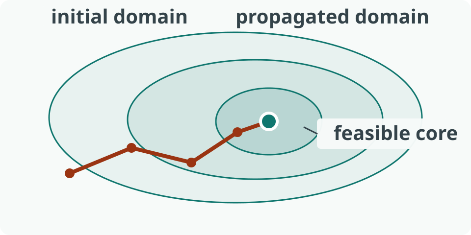

# Propagation workbench

::: variant section-title
:::

State, evidence, and algorithmic change stay visible on one technical field.

::: notes
The segmented trace bus and sparse grid distinguish SV from the editorial Science Theme.
:::

---

# The work queue changes the cost

::: variant claim
:::

[fit] Recompute only the pairs made stale by domain events.

::: columns widths="1/1" gap="4" align="start"
Specification:

- one support relation
- one observable invariant

Implementation:

- advisor-backed scheduling
- incremental stale-pair queue
:::

---

# Two kernels expose different work

::::: comparison
:::: primary label="Global scan"
42 stale pairs

- inspect the full relation
- simple state
::::
:::: supporting label="Advisor queue"
11 stale pairs

- revisit changed supports
- explicit maintenance
::::
:::::

---

# Update the bound in stages

::: variant derivation
:::

```text reveal="3|4|5-6"
A ← active sites
T ← remaining thresholds
build conflict graph Gₜ[A]
compute a maximal matching M
refute t when |A| - |M| < p
commit the largest surviving level
```

---

# Evidence occupies the field

::: variant figure
:::

::: figure src="assets/science-orbit.svg" alt="Nested feasible regions connected by a search trajectory" caption="The workbench frame leaves the evidence large while retaining a Technical caption." fit="contain" radius="4"
:::

---

# Gallery states remain comparable

::: variant figure
:::




---

# Runtime follows the queue length

::: vega-lite
{
  "$schema": "https://vega.github.io/schema/vega-lite/v5.json",
  "data": { "url": "data/columns-runtime.csv" },
  "mark": "line",
  "encoding": {
    "x": { "field": "n", "type": "quantitative" },
    "y": { "field": "ms", "type": "quantitative" }
  }
}
:::

--

## Detail: the evidence ledger stays readable

::: variant dense
:::

| Kernel | Nodes | Runtime |
| --- | ---: | ---: |
| Global scan | 42 | 18.4 s |
| **Advisor queue** | **11** | **6.2 s** |

$$
z^\star = \min_{x \in D} c^\mathsf{T}x
$$
