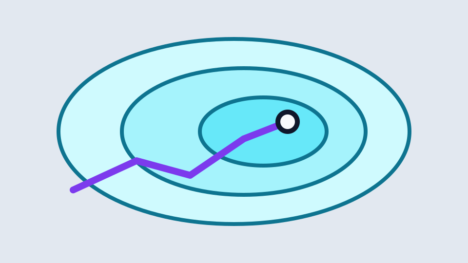

# Inspect the contract

::: variant section-title
:::

The Debug Theme labels renderer-owned regions without moving them.[^contract]

- Frame, header, body, and primary
- Supporting, sources, footer, and ornament

[^contract]: Run `zpres theme check themes/debug --visual --inspection --write-specimen <dir>` to retain computed region bounds for every live state and PDF page.

^ The diagnostic overlay is optional and never enters semantic reading order.

---

# Claim and preset hooks are observable

::: preset spotlight
:::

[fit] A Theme changes visual voice without changing Source meaning.

---

# Figure regions are observable

::: variant figure
:::

::: figure src="comparison-field.svg" alt="Feasible region with a highlighted core" caption="CAPTION WRAP CASE · The Figure lane owns evidence; this deliberately longer Caption verifies that wrapped explanatory text remains attached to its double-line boundary." fit="contain" radius="10"
:::

Evidence source.[^figure-source]

[^figure-source]: Source: synthetic feasible-region comparison, Debug specimen.

---

# Main and Detail roles

The Main slide establishes the Section argument.

--

## Detail evidence

The Detail slide retains its explicit role on screen and in print.

---

# Step state is observable

The Step route remains identifiable before the first reveal.

::: steps
1. Parse the Source file into the typed Deck model.
2. Render peer HTML presentation and PDF export surfaces.
3. Review the original-size state before approving the contact sheet.
:::

---

# Comparison roles are observable

::::: comparison
:::: primary label="Baseline"
::: fit
42 nodes
:::

Chronological branching

> [!NOTE] Qualification
> Same instance and stopping rule.
::::

:::: supporting label="Candidate"
::: fit
11 nodes
:::

Impact-guided branching

> [!NOTE] Qualification
> Same instance and stopping rule.
::::
:::::

---

# Comparison evidence shares guides

::::: comparison
:::: primary label="Before propagation"
::: figure src="comparison-field.svg" alt="Baseline feasible region with a circular comparison cue" caption="Larger feasible region" fit="contain" radius="10"
:::
::::

:::: supporting label="After propagation"
::: figure src="comparison-field.svg" alt="Reduced feasible core with a square comparison cue" caption="Smaller feasible core" fit="contain" radius="10"
:::
::::
:::::

---

# Narrow comparison stays linear



::::: comparison
:::: primary label="Baseline"
42 nodes
::::

:::: supporting label="Candidate"
11 nodes
::::
:::::

---

# Derivation state is observable

::::: derivation
:::: context label="Invariant"
For every \(t\), \(x_t \in D\).
::::
:::: stage label="Transition"
$$x_{t+1}=f(x_t,u_t)$$
::::
:::: stage label="Consequence"
Therefore \(x_{t+1} \in D\).
::::
:::::

---

# Process stages are observable

::::: derivation pdf="pages"
:::: context label="Fixed input"
Use one Source file and one Theme package.
::::
:::: stage label="Parse"
Build the typed Deck model.
::::
:::: stage label="Render"
Produce peer screen and print surfaces.
::::
:::: stage label="Review"
Inspect page images and contact sheets.
::::
:::::

---

# Dense evidence stays off the Main path

The Main slide points to compact technical evidence without shrinking itself.

--

## Detail technical roles are observable

::: variant dense
:::

| Model | Nodes | Runtime |
| --- | ---: | ---: |
| Baseline | 42 | 18.4 s |
| **Candidate** | **11** | **6.2 s** |

```rust
let bound = propagate(&model);
assert!(bound <= incumbent);
```

$$
z^\star = \min_{x \in D} c^\mathsf{T}x
$$

---

# Autoscale diagnostics stay explicit

::: variant claim
:::

[fit] Recovered fit is a visible review warning.

- The valid release specimen exercises a near-boundary autoscale case.
- The report-only diagnostic specimen deliberately fails and is never the default Theme check fixture.

---

# Diagnostic ownership is explicit

The Step lifecycle is QUEUED, CURRENT, or COMPLETED. FAILED is a diagnostic result, not a fabricated fourth Step lifecycle state.

> [!WARNING] Controlled warning
> Autoscale below 100% remains visible in inspection evidence and in the visual report.
> Inspection keeps that warning beside the measured page so the report and raster cannot silently disagree.

> [!NOTE] Objective boundary
> Real overflow remains blocking; normal and inspection captures must agree on geometry.
